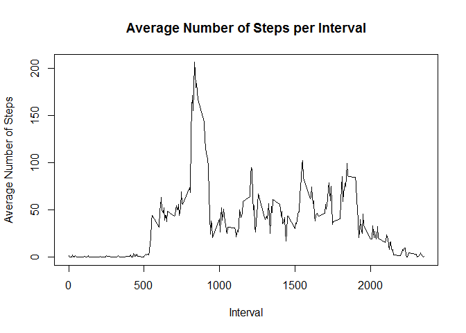

#Reproducible Research: Project 1

Loading of data from file

```r
raw.data <- read.csv(file = "activity.csv")
step.data <- raw.data[!is.na(raw.data$steps),]
```

Calculate total number of steps taken per day

```r
totalstep.data <- with(step.data, aggregate(step.data$steps, by=list(date), FUN = mean))
```

Plot histogram of total number of step taken per day

```r
hist(totalstep.data$x, main = "Total number of steps taken per day",
     xlab = "Total steps taken per day")
```

<!-- -->

Calculate mean and median of the total number of steps taken per day

```r
summary(totalstep.data$x)
```

```
##    Min. 1st Qu.  Median    Mean 3rd Qu.    Max. 
##  0.1424 30.6979 37.3785 37.3826 46.1597 73.5903
```

Calculate mean step per interval

```r
meandaily.data <- with(step.data, aggregate(step.data$steps, 
                                            by=list(interval),
                                            FUN=mean, na.rm=TRUE))
```

Plot average daily activity pattern

```r
library(ggplot2)
meandaily.plot <- ggplot(meandaily.data, aes(x=Group.1, y=x), 
                        xlabs = "Interval", 
                        ylab="Average Number of Steps")
plot(x=meandaily.data$Group.1, y=meandaily.data$x, xlab = "Interval",
     ylab = "Average Number of Steps", 
     main = "Average Number of Steps per Interval", type = "l")
```

<!-- -->

Identify the interval that contains the maximum number of steps

```r
maxstep <- max(meandaily.data$x)
meandaily.data[meandaily.data$x == maxstep, 1] 
```

```
## [1] 835
```

##Imputing NA.

The strategy for imputing NAs would be substitute the missing steps with the matching average 5-minute interval.

```r
## Load library for ddply function
library(plyr)
avg.data <- ddply(step.data, .(interval), summarise, steps = mean(steps))

## Replace NAs with matching intervals of the day
na.data <- raw.data[is.na(raw.data$steps),]
test.condition <- match(avg.data$interval, na.data$interval)
na.data[!is.na(test.condition), "steps"] <- avg.data[na.omit(test.condition), "steps"]
```

Creating new dataset

```r
merge.data <- rbind(step.data, na.data)
```

Make a histogram of the total number of step taken each day

```r
totalstep2.data <- aggregate(merge.data$steps ~ merge.data$date, FUN= mean)
hist(totalstep2.data$`merge.data$steps`, main = "Total number of steps      taken per day",
     xlab = "Total steps taken per day")
```

<!-- -->

Report mean and median of the total number of steps taken per day

```r
summary(merge.data$steps)
```

```
##    Min. 1st Qu.  Median    Mean 3rd Qu.    Max. 
##    0.00    0.00    0.00   37.38   27.00  806.00
```

Report differences (if any) between weekday and weekend

```r
library(plyr)
library(lattice)
merge.data$day <- weekdays(as.Date(merge.data$date))
merge.data$dayCat <- ifelse(merge.data$day %in% c("Saturday",                                      "Sunday"), "Weekend", "Weekday")
WeekdayVWeekend.data <- ddply(merge.data, .(interval, dayCat), summarise, steps = mean(steps))
xyplot(steps~interval|dayCat, data = WeekdayVWeekend.data, type="l", layout=c(1,2), main="Average Steps per interval Based on Type of Day", ylab="Average Number of Steps", xlab="Interval")
```

<!-- -->
